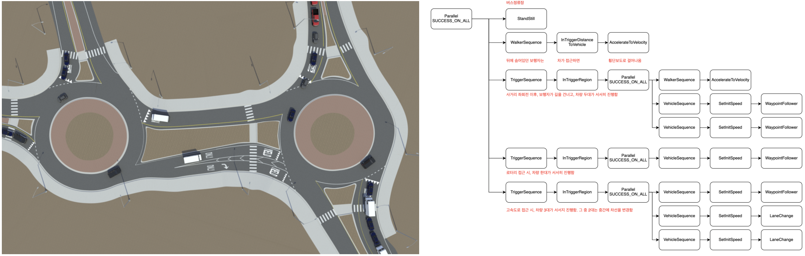
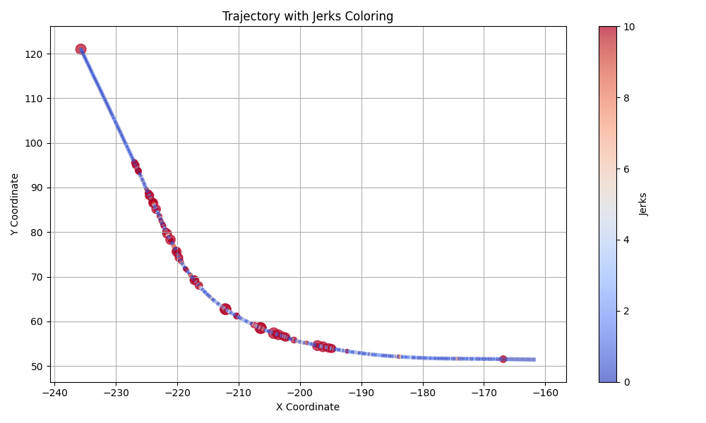

## l4-odd-scenario-evaluation
* 과제명: 현실 가상정보 융합 자율주행 시뮬레이터 연동 시뮬레이션 프레임워크 차량기반 시뮬레이션

### Contents
1. [목적](#목적)
2. [주요 내용](#주요-내용)
3. [기대 효과](#기대-효과)
4. [주관 및 참여 기관](#주관-및-참여-기관)

### 목적

자율주행 서비스로부터 취득한 데이터를 이용하여 시나리오를 개발하고, 시뮬레이터 개발 관점에서 인터페이스, 기능, assets 등 다양한 측면에서 개선 포인트를 발굴합니다.

#### 주요 개발 목표
* 레벨4이상 자율주행 ODD 구체화 및 단일/복합 시나리오 평가 방법 설계
* 시뮬레이터의 주요 요구 기능 정의 - 주요 기능구조, 인터페이스 정의 수행

### 주요 내용

* 레벨4이상의 자율주행 테스트를 위한 시뮬레이터 기능 요구사항 정의
* ODD 기반의 단일/복합 시나리오 설계 및 평가
  * 자율주행 서비스 기반의 시나리오 설계 및 평가

#### 평가 예시
자율주행 궤적을 이용하여 승차감 평가 및 개선 포인트 발굴
* 아래는 시뮬레이터 활용 좌회전 궤적에서 jerk를 평가하여 궤적에 도시한 예

### 기대 효과
| 측면 | 설명 |
|------|------|
| 기술적 측면 | 해외 선진기업과 같은 정밀 시뮬레이션 수행 기술 확보 등 |
| 경제적, 산업적 측면 | 실차 주행 대체로 인한 시험 비용 및 기간 절감 등 |
| 사회적 측면 | 자율주행차의 안전성 확보, 데이터 관리 및 시뮬레이션 분야 일자리 창출 등 |

### 주관 및 참여 기관
* 주관기관: 한국전자기술연구원
  * 상위구조 정의 및 데이터셋 사양 개발
* 참여기관 1(모라이): 시뮬레이터 엔진 기본 구조 설계
* 참여기관 2(포티투닷): 레벨4이상 자율주행을 위한 ODD기반 시뮬레이터 요구사항 정의
* 참여기관 3(지능형자동차부품진흥원): 자율주행 시뮬레이션 기반 검증 기술 설계
* 참여기관 4(인하대학교): 선행연구 분석 및 시뮬레이터 기능·규격·요구사항 정의