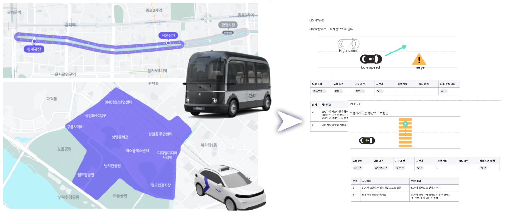

## 현실 가상정보 융합 자율주행 시뮬레이터 연동 시뮬레이션 프레임워크 차량기반 시뮬레이션

### 목차
1. [목적](#목적)
2. [주요 내용](#주요-내용)
3. [기대 효과](#기대-효과)
4. [역할](#역할)

### 목적

#### 주요 개발 목표
* 레벨4이상 자율주행 ODD 구체화 및 단일/복합 시나리오 평가 방법 설계
* 시뮬레이터의 주요 요구 기능 정의
  * 주요 기능구조, 인터페이스 정의 수행

### 주요 내용

 
* 레벨4이상의 자율주행 테스트를 위한 시뮬레이터 기능 요구사항 정의
* ODD 기반의 단일/복합 시나리오 설계 및 평가
  * 자율주행 서비스 기반의 시나리오 설계 및 평가
  * .

### 기대 효과
| 측면 | 설명 |
|------|------|
| 기술적 측면 | 해외 선진기업과 같은 정밀 시뮬레이션 수행 기술 확보 등 |
| 경제적, 산업적 측면 | 실차 주행 대체로 인한 시험 비용 및 기간 절감 등 |
| 사회적 측면 | 자율주행차의 안전성 확보, 데이터 관리 및 시뮬레이션 분야 일자리 창출 등 |

### 역할

